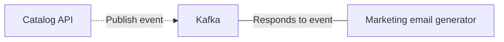

# Hands-on Two: Writing an event-driven GenAI application that uses Docker Model Runner

## Learning objectives

In this hands-on, you will complete the following objectives:

- View and use models locally using Docker Model Runner
- Create an event-driven app that generates a marketing email based on newly created products

Let's get started!


## Step 1: Exploring Docker Model Runner

The Docker Model Runner is a new feature that enables the usage of models locally.

1. Validate Docker Model Runner is running by using the following command:

    ```bash
    docker model status
    ```

    You should see output similar to the following:

    ```console
    Docker Model Runner is running

    Status:
    llama.cpp: running llama.cpp latest-opencl (sha256:dbbe8c24f2107faccd6ee5b215bdc4c1d6d278c76fa3a3882da791d06ebd2e3) version: a0f7016
    ```

    This indicates it is running and that we have a llama.cpp backend that is using OpenCL (the GPU driver).

2. Let's look at the models we have loaded on the machine (your workstation should have one preloaded for this lab):

    ```bash
    docker model list
    ```

    You should see output similar to the following:

    ```console
    MODEL NAME                                     PARAMETERS  QUANTIZATION    ARCHITECTURE  MODEL ID      CREATED      SIZE       
    jacobhoward459/phi4-mini-instruct:3.84B-Q4_0   3.84 B      Q4_0            phi3          533cee59d9b6  4 days ago   2.16 GiB 
    ```

    If you _do not_ see any models, pull the model using the following command:

    ```bash
    docker model pull jacobhoward459/phi4-mini-instruct:3.84B-Q4_0
    ```

    This will take a little bit to download, as the model is ~2.2GB.

    If you want to see what other models are available, you can [check out the official AI catalog on Docker Hub](https://hub.docker.com/u/ai).

3. Let's run a simple query against the model using the following command:

    ```bash
    docker model run jacobhoward459/phi4-mini-instruct:3.84B-Q4_0 "Hello! What can I do for fun in Seattle in 200 characters or less?"
    ```

    It may take a few seconds to load the model, but then you'll get your answer streamed to the console.

    Feel free to try out a few other queries!

## Step 2: Preparing the development environment

We're going to build on the example of the Kafka cluster from the previous lab by building a tool that now responds to the event published in the topic. The flow will look something like this:



In real situations, you'll likely want to leverage marketing operation systems to find relevant email addresses, send emails via an email provider, and more. For the purposes of this demo, we're going to keep the example very simple. 

1. Open the `src/index.js` file and take a look at what's in there.

    You'll see code that is already connecting to a Kafka cluster, listening for events, and then printing the event to the console.

2. If you don't have the Compose stack running from the previous hands-on, go back and launch it.

3. Install the app's dependencies by running the following command while in the repo's `app` directory:

    ```bash
    npm install
    ```

4. Start the app in development mode by running the following command:

    ```bash
    npm run dev
    ```

    This command uses a tool called `nodemon`, which will automatically restart the app when you make changes to any `**/*.js` file. That way, we can write code, save the file, and immediately see it be applied.

    > [!INFO]
    > If you see a `ERROR` message indicating "The group coordinator is not available", you can safely ignore this message. It resolves itself and should technically be an "info" message, not an "error".


## Step 3: Creating the app

As mentioned earlier, we are going to respond to events and use a GenAI model to create a marketing email for customers that might be interested in the new product (again... deferring that customer selection for now).

1. Open the `src/index.js` file and update the top of your file to look like the following:

    ```javascript
    const { Kafka } = require('kafkajs');
    const OpenAI = require('openai');

    // START COPYING HERE
    const openai = new OpenAI({
      baseURL: process.env.OPENAI_BASE_URL || "http://localhost:12434/engines/v1",
      apiKey: "not-required",
    });
    // STOP COPYING HERE

    // Kafka configuration
    ...
    ```

    This snippet creates an OpenAI client, but configures it to use a local endpoint (which is where Docker Model Runner is running).

2. Let's define a "system prompt" that the model will use to inform how it should behave, its various rules, and the expected output. Just below the snippet you added above, add the following:

    ```javascript
    const openai = new OpenAI({
      baseURL: process.env.OPENAI_BASE_URL || "http://localhost:12434/engines/v1",
      apiKey: "not-required",
    });

    // START COPYING HERE
    const SYSTEM_PROMPT = `You are a tool that is used to generate marketing emails to potential customers for a newly created product. You will be given the name and description of the product, and you will generate a marketing email to potential customers.
        
    The result should be a JSON object with the following structure:
    {
      "subject": "Subject line for email",
      "body": "Body of email"
    }
    
    Do NOT include any additional information or explanations. Only the JSON object should be returned.
    
    The email MUST be less than 200 words in length. 
    The email MUST be in English and should be written in a friendly and engaging tone. 
    The email should include a call to action, such as "Click here to learn more" or "Order now". 
    The email should also include a subject line that is catchy and relevant to the product.
    The email should be relevant to the product and should not contain any irrelevant information. 
    The email should be written in a way that is easy to understand and should not contain any technical jargon. 
    The email should be written in a way that is engaging and should not be boring. 
    The email should be written in a way that is persuasive and should not be pushy. 
    The email should be written in a way that is friendly and should not be rude. 
    The email should be written in a way that is professional and should not be unprofessional.
    `;

    // STOP COPYING HERE
    ```

3. Now that we have a prompt and OpenAI client, let's update the Kafka message listener to use it!

    In the `processMessage` function at the bottom of the file, update it to look like the following:

    ```javascript
    async function processMessage(data) {
      console.log('Received message:', data);

      console.log('Generating email now');
    
      // Generate sample marketing emails
      const response = await openai.chat.completions.create({
        model: process.env.OPENAI_MODEL || 'jacobhoward459/phi4-mini-instruct:3.84B-Q4_0',
        messages: [
          {
            role: "system",
            content: SYSTEM_PROMPT,
          },
          {
            role: 'user',
            content: `Product name: ${data.name}.\nProduct description: ${data.description}\n`,
          },
        ],
      });
    
      // Sometimes, models still wrap JSON in markdown code blocks, so let's remove that.
      let responseText = response.choices[0].message.content;
      if (responseText.startsWith('```json')) {
        responseText = responseText.slice(7, -3);
      }
    
      // Simply output them to the console.
      // In real situations, we'd look up relavent customers and queue emails.
      const { subject, body } = JSON.parse(responseText);
      console.log(`Subject: ${subject}`);
      console.log(`Body: ${body}`);
    }
    ```

4. Now, send a message to the queue using the Kafbat UI we used in the last lab. Here's an example message you can use:

    ```json
    {
      "action": "product_created",
      "id": "product-51cb2813",
      "name": "LucidFlow",
      "description": "A bedside device utilizing subtle, dynamically shifting ambient light and binaural audio to gently guide you into deeper, more restorative sleep. Connects to your Microsoft 365 calendar to proactively adjust lighting and soundscapes based on your upcoming schedule, minimizing stress and promoting optimal rest."
    }
    ```

    After a moment, you should see the generated email to help market this new product!

## Recap

In this hands-on, you accomplished the following:

- Experimented with Docker Model Runner by listing models and running a model directly in the CLI
- Created a simple event-driven GenAI application that generates marketing emails based on incoming events
